<p align="center">
	
</p>
<h1 align="center" style="margin: 30px 0 30px; font-weight: bold;">RuoYi v3.9.0</h1>
<h4 align="center">基于SpringBoot+Vue前后端分离的Java快速开发框架</h4>
<p align="center">
	<a href="https://gitee.com/y_project/RuoYi-Vue/stargazers"></a>
	<a href="https://gitee.com/y_project/RuoYi-Vue"></a>
	<a href="https://gitee.com/y_project/RuoYi-Vue/blob/master/LICENSE"></a>
</p>


## 配置项目启动

### 后端

修改ruoyi-admin/src/main/resources/application-druid.yml

配置数据库连接信息

启动mysql服务，启动redis服务

运行sql/路径下的脚本，确保运行成功

启动ruoyi-admin/src/main/java/com/ruoyi/RuoYiApplication.java

### 前端

确认安装node

ruoyi-ui/目录下命令行执行

```bash
npm install
npm run dev
```

## 代码生成

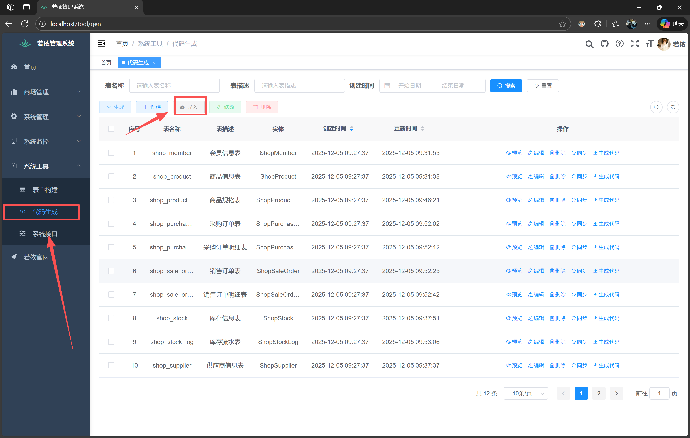

如图打开代码生成界面

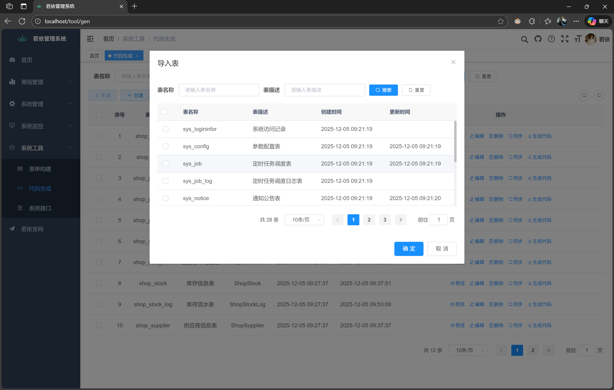

点击导入是导入数据库中存在的表，也可以使用创建，可以创建未存在的表

导入表后打开编辑

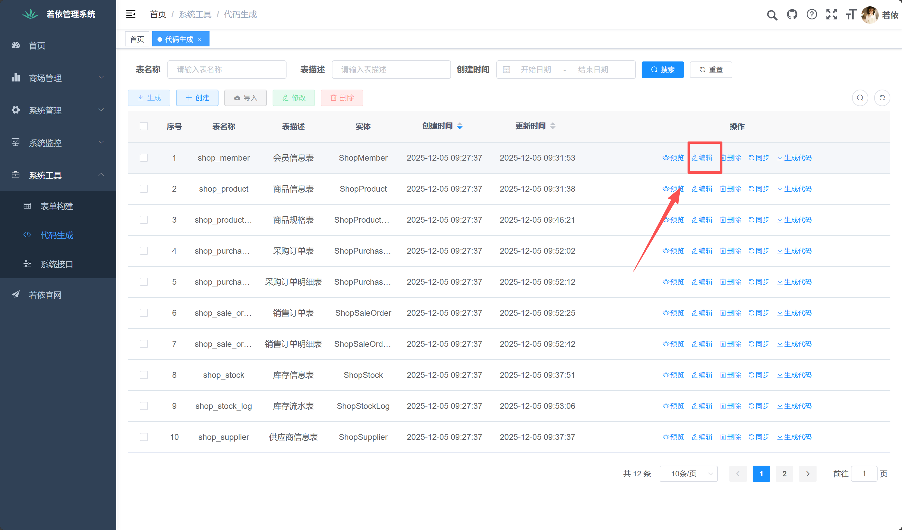

确保业务名没有重复且不合法的写法，没有问题点击提交

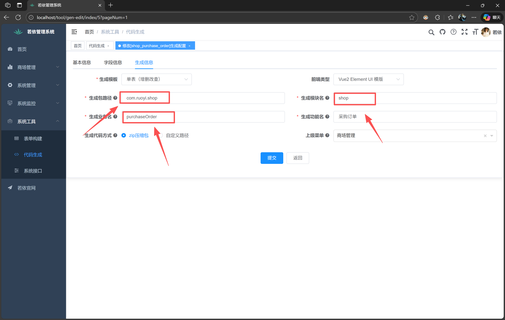

菜单可以如下图所示位置创建

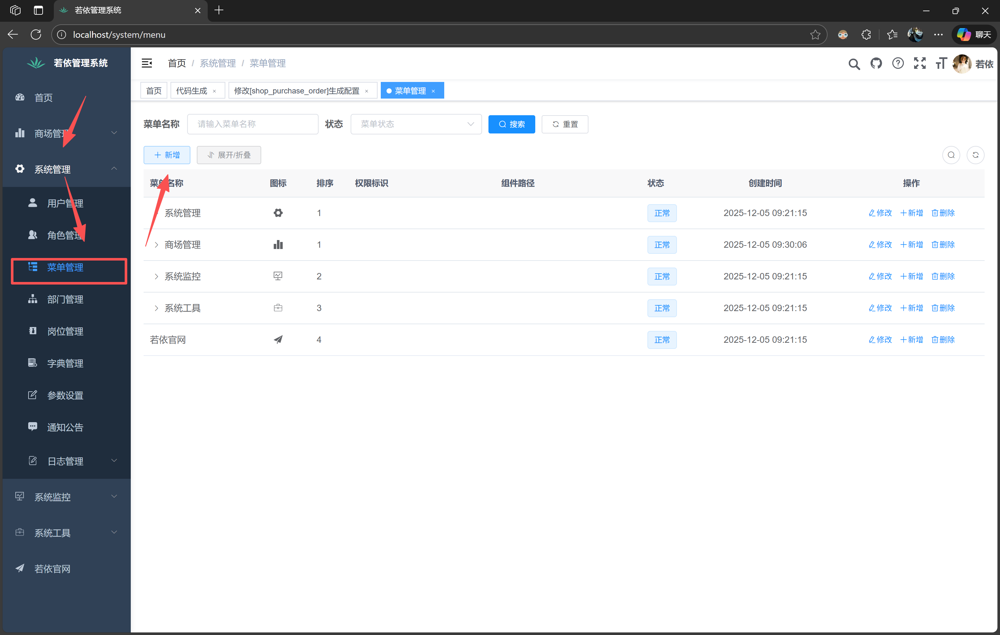

选择表，点击生成

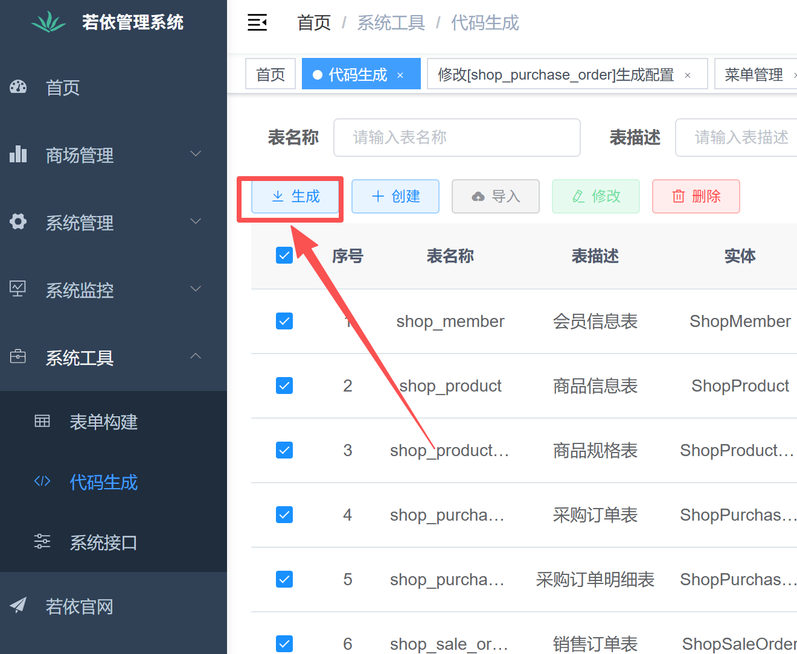

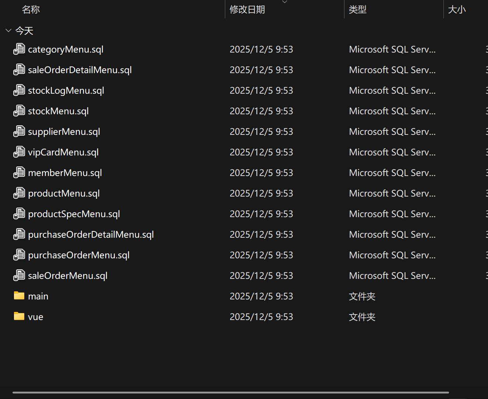

## 代码导入

### 后端

使用idea打开项目，右键项目，新建模块

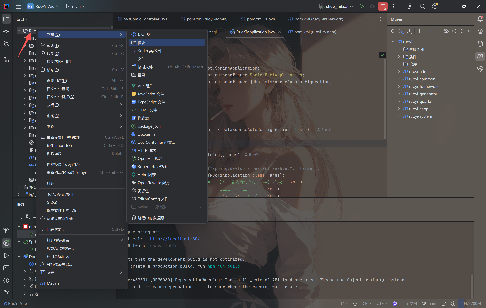

模块名称与代码生成设置的保持一致

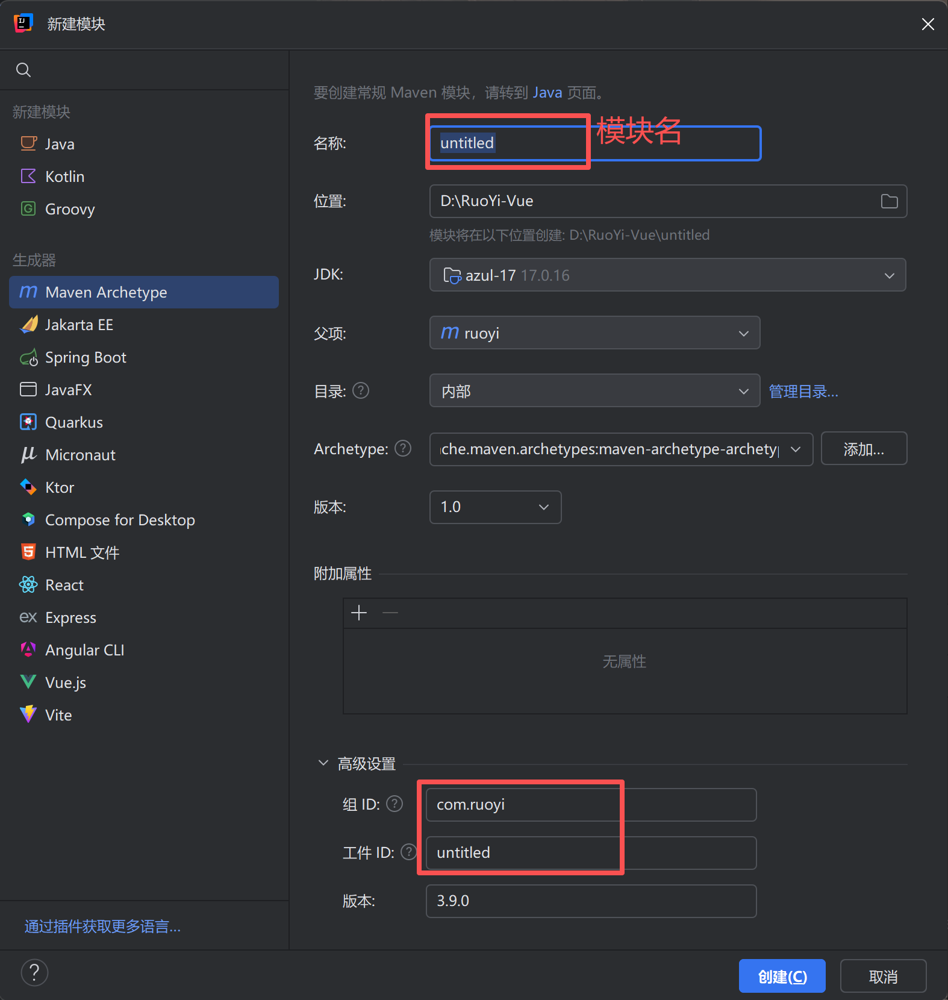

创建后复制一份ruoyi-system/pom.xml到新创建的模块中替换掉创建时生成的pom文件，同时修改artifactId名为模块名

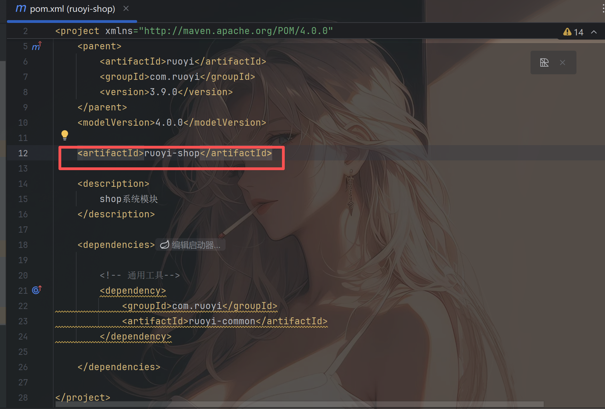

打开ruoyi-framework/pom.xml，添加新增模块坐标

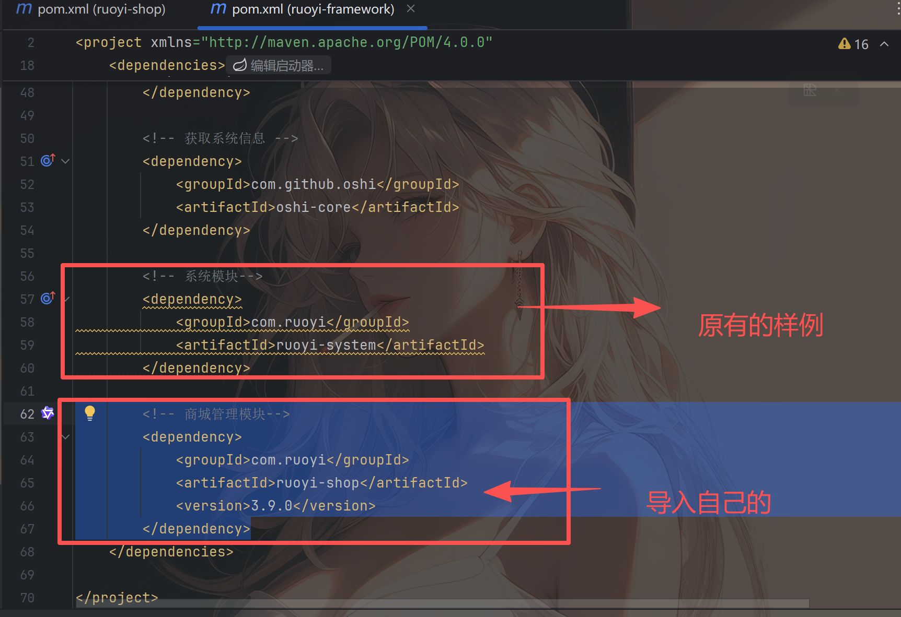

重新构建项目

打开生成的代码压缩包，将main目录下的文件放置到如下，除contorller目录下的内容放置如下

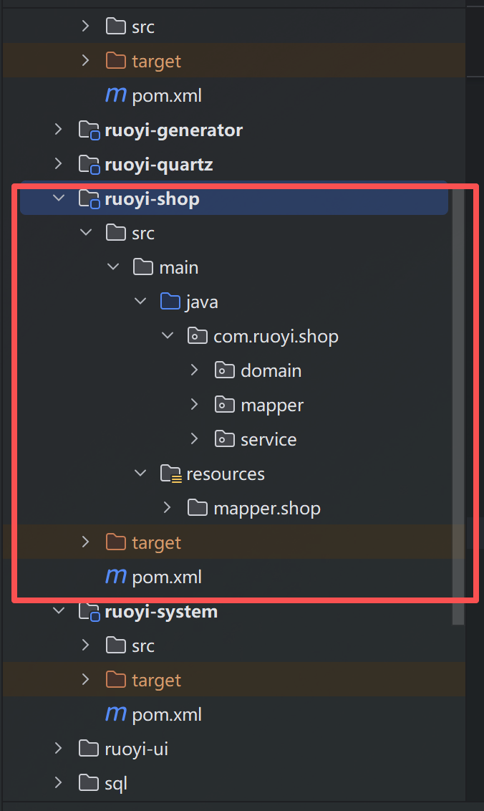


在ruoyi-admin/src/main/java/com/ruoyi/web/controller目录下新建目录为创建的模块名，复制controller目录下文件到此处

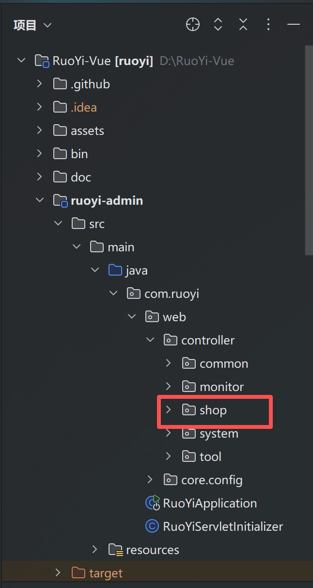

### 前端

将vue目录下的文件放置到ruoyi-ui/src下

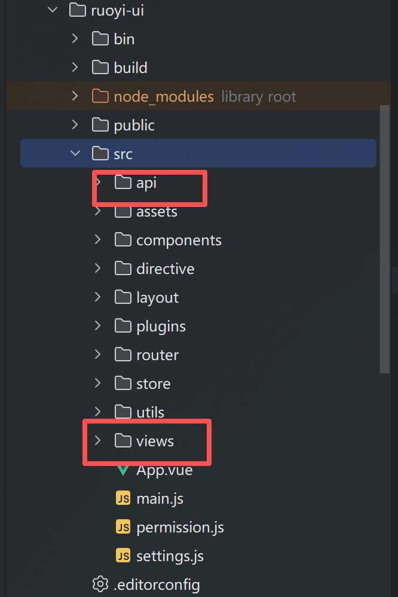

### 数据库

运行压缩包中的sql脚本

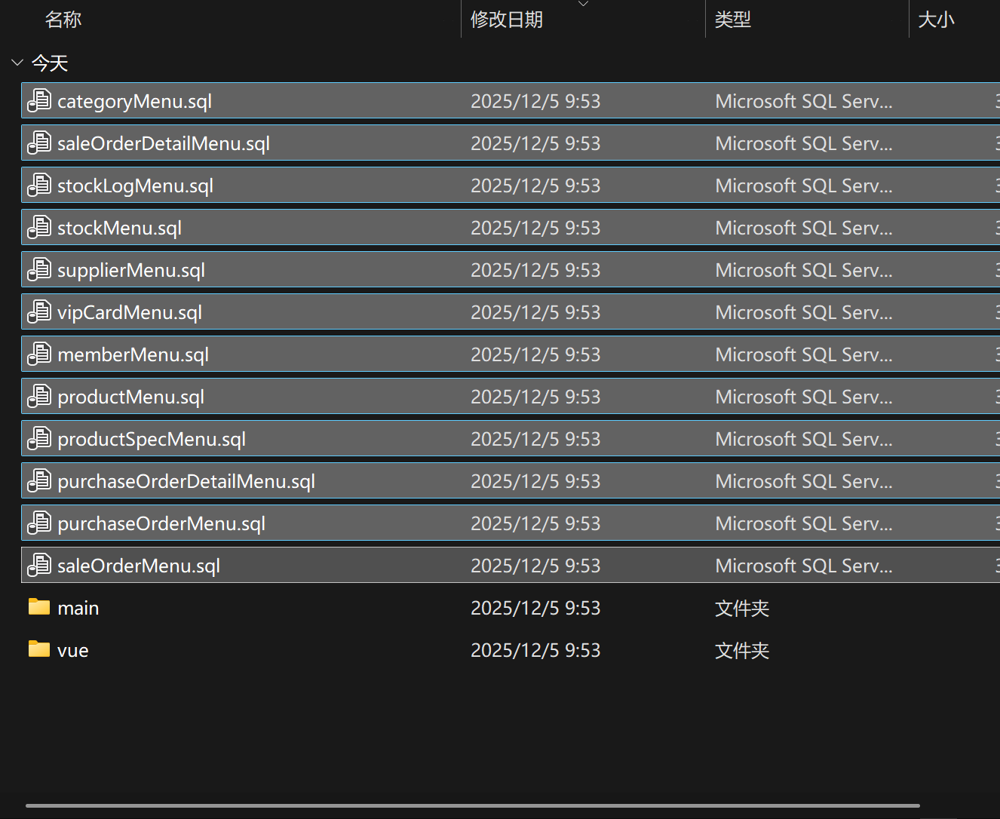

运行后启动前后端服务，刷新，项目生成代码运行成功
